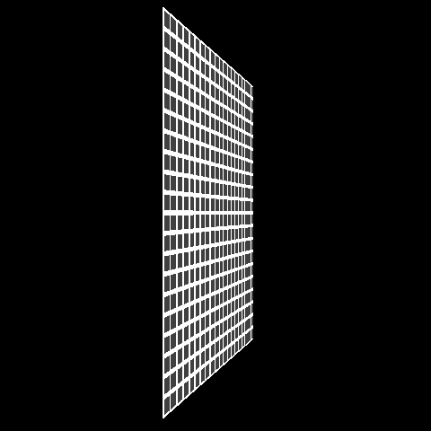

# Software Rasterizer

Very simple software triangle rasterizer in C.

## Notes

- Requires GLFW3.0 to run.
- Tested only on Mac OS Catalina.
- Check this [Fabian Giesen's article series](https://fgiesen.wordpress.com/2013/02/17/optimizing-sw-occlusion-culling-index/) where triangle rasterization is described, great reading.
